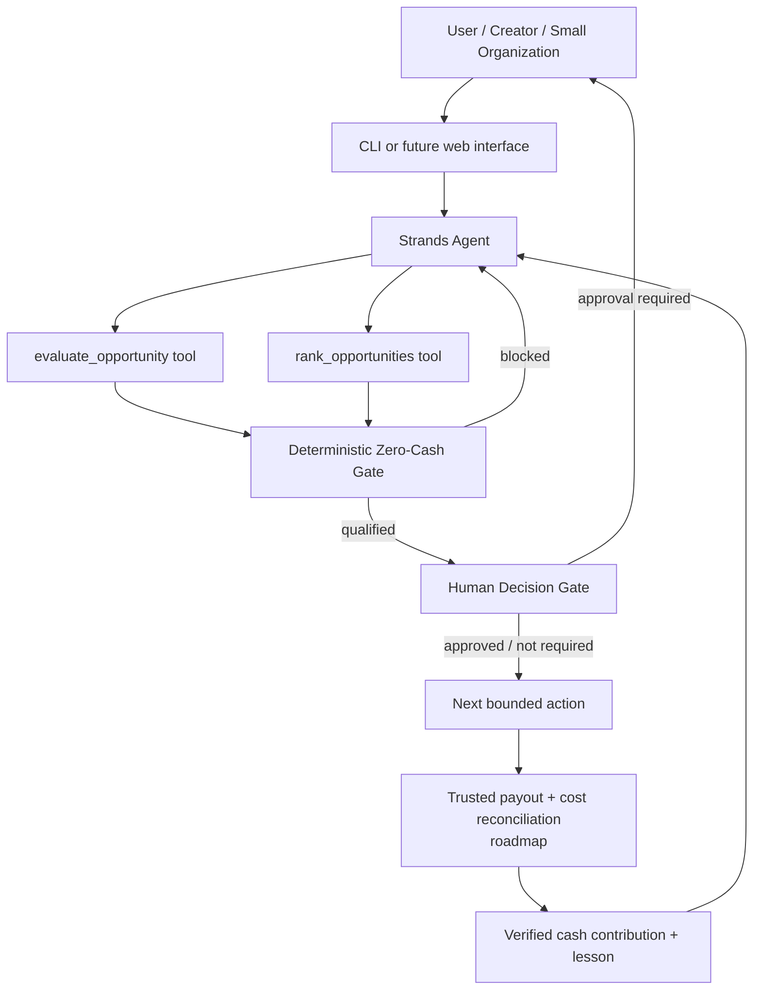

# Architecture

## Execution philosophy

The Strands model is responsible for language, reasoning, comparison, explanation, and tool orchestration. It is **not** the source of truth for economic eligibility.

The deterministic gate evaluates structured opportunity data. It blocks candidates that violate the zero-new-cash constraints or lack clear rights, eligibility, legitimacy, or payout verification.

Third-party terms, identity representations, legal commitments, publication, and spending are escalated to a human. This creates a human-in-the-loop architecture for consequential decisions without turning routine comparison and prioritization back into manual work.

## Agent loop

1. Receive up to three candidate opportunities.
2. Invoke deterministic qualification/ranking tools.
3. Explain rejected candidates and their blockers.
4. Rank only candidates that pass the hard gate.
5. Surface human-only decisions precisely when needed.
6. Recommend the smallest bounded next action.
7. Future reconciliation verifies actual payout and subtracts fees, refunds, reserves, and attributable costs before the system can claim a successful earning event.

## AWS / Strands placement

Strands Agents SDK provides the agentic loop and tool-use layer. The current hackathon package can run locally and is intentionally provider-light to honor the zero-capital premise. Amazon Bedrock / AgentCore are natural deployment extensions, but the prototype does not require paid AWS infrastructure to demonstrate the core behavior.
