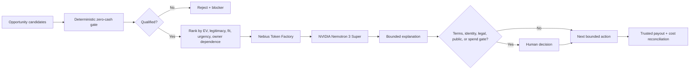

# Earn Before Spend

**A zero-capital opportunity agent that keeps economic authority outside the model.**

Earn Before Spend helps creators, independent professionals, small businesses, and community organizations answer one question:

> **What is the smallest credible way I can move from $0 in new seed capital to verified positive cash contribution?**

The system compares earning pathways such as bounties, competitions, services, licenses, affiliate commissions, digital products, and grants. A deterministic Python layer blocks candidates that require new cash, hide excessive owner labor, have unclear rights or eligibility, or lack a verifiable payout path. The model can explain the ranking, but it cannot override the economic gate.

## Nebius x NVIDIA Global AI Hackathon

**Target track:** Best Apps and Agents

This branch significantly updates the existing project for the Nebius x NVIDIA submission period by adding a real Nebius Token Factory runtime path using the NVIDIA Nemotron 3 Super open model.

The architecture is intentionally split:

1. `core.py` performs deterministic qualification and ranking.
2. `nebius_model.py` sends the resulting ranking to **NVIDIA Nemotron 3 Super** on **Nebius Token Factory** through its OpenAI-compatible chat-completions API.
3. Nemotron explains the top qualified option, bounded next action, human approval gate, and useful runner-up.
4. The model is explicitly prohibited from reversing deterministic qualification decisions or calling hypothetical value earned money.

The default demo remains offline and makes **no provider call**. A Nebius request happens only when a human has intentionally configured `NEBIUS_API_KEY` and set `RUN_NEBIUS=1`.



### Nebius/NVIDIA integration

- **Nebius service:** Token Factory inference API
- **Model:** `nvidia/nemotron-3-super-120b-a12b`
- **API style:** OpenAI-compatible `POST /v1/chat/completions`
- **Runtime proof path:** `RUN_NEBIUS=1 python demo.py`
- **Fail-closed behavior:** missing `NEBIUS_API_KEY` raises before any network call
- **Secret handling:** the API key is read from the environment and is never committed or logged
- **Economic authority:** deterministic ranking remains canonical; model output is explanation only

## Why it matters

People routinely spend before validating whether an idea can earn anything. Earn Before Spend flips that sequence:

1. Find legitimate opportunities.
2. Prove they can be pursued without new cash.
3. Rank only qualified options.
4. Surface legal, identity, terms, publication, and spending decisions to a human.
5. Take the smallest bounded next action.
6. Count money only after trusted payout verification and cost reconciliation.

A possible prize is not revenue. A test payment is not revenue. An owner deposit is not revenue. Credits are not revenue.

## Guardrails

An opportunity is blocked when any of these are true:

- it requires new cash before the earning event;
- it requires more than the allowed owner-fulfillment time;
- rights are unclear;
- eligibility is unclear;
- payout cannot be independently verified;
- legitimacy is below the threshold;
- the probability input is invalid.

The agent also refuses to treat gambling, paid-entry speculation, securities/crypto trading, owner deposits, loans, gifts, test payments, or hypothetical value as earnings.

## Run the deterministic demo

No model provider is required.

```bash
python demo.py
```

## Run tests

```bash
python -m unittest test_core.py test_nebius_model.py -v
```

`test_nebius_model.py` uses a fake HTTP response; tests do not consume Nebius tokens or require a real API key.

## Run with Nebius Token Factory

Only do this with an authorized, capped/free-credit route. The repository does not create an account, accept provider terms, enable billing, or provision paid resources.

```bash
export NEBIUS_API_KEY="..."
RUN_NEBIUS=1 python demo.py
```

Optional overrides:

```bash
export NEBIUS_MODEL="nvidia/nemotron-3-super-120b-a12b"
export NEBIUS_BASE_URL="https://api.tokenfactory.us-central1.nebius.com/v1/"
```

## Earlier Strands implementation

The repository originally served as the standalone public implementation for AWS Agents for Humans and retains its Strands Agents SDK wrapper in `agent.py`. `RUN_STRANDS=1` remains available for that historical demonstration. The Nebius branch does not claim that the older Strands path satisfies the Nebius/NVIDIA runtime requirement; the qualifying path is the explicit Token Factory + NVIDIA Nemotron integration above.

## Files

- `core.py` - deterministic qualification and ranking engine
- `nebius_model.py` - Nebius Token Factory / NVIDIA Nemotron explanation adapter
- `test_nebius_model.py` - zero-network adapter tests
- `agent.py` - earlier Strands tools and system policy
- `demo.py` - offline demo plus opt-in Nebius/Strands model runs
- `test_core.py` - focused economic guardrail tests
- `ARCHITECTURE.md` - earlier architecture notes
- `RESEARCH.md` - two-agent economic research protocol
- `NEBIUS-DEVPOST.md` - Nebius x NVIDIA submission draft and evidence lock

## Development disclosure

AI coding assistance was used. The concept was informed by earlier private work on safe autonomous-agent economics, but this public repository contains no private BLVX/Bonita source imports, customer data, user data, private prompts, secrets, or proprietary cultural datasets.

## License

MIT
