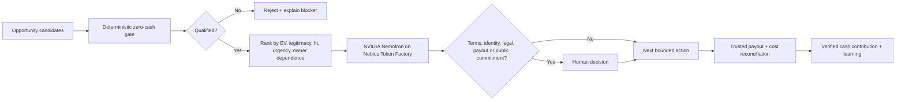

# Earn Before Spend

**A zero-capital opportunity agent with a deterministic economic gate and an NVIDIA Nemotron reasoning layer on Nebius Token Factory.**

Earn Before Spend helps creators, independent professionals, small businesses, and community organizations answer one practical question:

> **What is the smallest credible way I can move from $0 in new seed capital to verified positive cash contribution?**

The system compares earning paths such as bounties, competitions, services, licenses, affiliate commissions, digital products, and grants/awards. A deterministic Python guardrail layer blocks candidates that require new cash, hide too much owner labor, have unclear rights or eligibility, or lack a verifiable payout path. The model can explain tradeoffs and choose the next bounded action, but it cannot override those economic rules.

A possible prize is not revenue. A test payment is not revenue. An owner deposit is not revenue. Credits are not revenue.

## Nebius x NVIDIA Global AI Hackathon

**Track:** Best Apps and Agents

This repository now includes a material hackathon-period adaptation that routes the reasoning/explanation layer through **NVIDIA Nemotron 3 Super** served by **Nebius Token Factory** while keeping the deterministic zero-capital gate authoritative.

- Nebius route: `https://api.tokenfactory.us-central1.nebius.com/v1/`
- Default model: `nvidia/nemotron-3-super-120b-a12b`
- The Token Factory call is additive; the original provider-free deterministic demo remains available.
- No API key is committed to the repository.
- No resource is provisioned automatically.
- Terms acceptance, identity/legal attestations, public submission, spending, payout connections, and money movement remain human-controlled.

### Material update during the submission period

The project existed before the Nebius submission period. The significant update for this hackathon is the Nebius Token Factory + NVIDIA Nemotron execution path, its offline verification tests, a judge-safe live smoke-evidence command, and hackathon-specific run documentation. The earlier Strands/AWS path remains in the repository as provenance and is not represented as the Nebius execution layer.

## Quick start

Python 3.10+ is recommended.

```bash
pip install -r requirements.txt
```

### Provider-free deterministic demo

```bash
python demo.py
```

### Offline tests

```bash
python -m unittest test_core.py test_nebius_agent.py -v
```

### Live Nebius / Nemotron run

A live run requires an existing, approved Nebius Token Factory API key:

```bash
export NEBIUS_API_KEY="..."
python nebius_smoke.py
```

`nebius_smoke.py` performs one live completion and prints a sanitized evidence record containing the provider, model, Token Factory host, UTC completion time, hashes of the deterministic context and model completion, and the completion text. It never prints the API key. A successful result proves one observed Token Factory/Nemotron call only; it is not evidence of earnings, payout, deployment scale, or contest acceptance.

Optional overrides:

```bash
export NEBIUS_MODEL="nvidia/nemotron-3-super-120b-a12b"
export NEBIUS_BASE_URL="https://api.tokenfactory.us-central1.nebius.com/v1/"
```

## Architecture



### Core components

- **Deterministic Economic Gate**: Python rules that the model cannot override.
- **Nebius/Nemotron Reasoning Layer**: explains ranked options and selects the smallest bounded next action from the already-qualified context.
- **Human Decision Gate**: terms acceptance, identity attestations, legal commitments, publication, payout connections, and spending remain human-controlled.
- **Reconciliation Layer (roadmap)**: verifies payouts and subtracts fees, refunds, reserves, and attributable costs before claiming success.

## Guardrails

An opportunity is blocked when any of these are true:

- it requires new cash before the earning event;
- it requires more than the allowed owner-fulfillment time;
- rights are unclear;
- eligibility is unclear;
- payout cannot be independently verified;
- legitimacy is below the threshold;
- the probability input is invalid.

The system also refuses to treat gambling, paid-entry speculation, securities/crypto trading, owner deposits, loans, gifts, test payments, or hypothetical value as earnings.

## Files

- `core.py` - deterministic qualification and ranking engine
- `nebius_agent.py` - Nebius Token Factory / NVIDIA Nemotron adapter
- `nebius_smoke.py` - one-command sanitized live-call evidence capture
- `test_nebius_agent.py` - network-free Nebius adapter tests
- `agent.py` - original Strands tools and policy layer
- `demo.py` - provider-free deterministic demo and sample opportunities
- `test_core.py` - deterministic guardrail tests
- `NEBIUS-NVIDIA.md` - hackathon adaptation notes and evidence checklist
- `ARCHITECTURE.md` - architecture and execution flow
- `DEVPOST.md` - earlier submission copy/provenance notes
- `RESEARCH.md` - two-agent research protocol and implementation limits
- `requirements.txt` - Python dependencies

## Earlier AWS/Strands provenance

The standalone public project was originally created during the AWS Agents for Humans submission period and used the Strands Agents SDK as its agentic layer. That history remains visible for provenance. The Nebius x NVIDIA adaptation is additive and clearly separated so judges can identify what changed during the current submission period.

The broader research direction explores whether bounded agents can discover legitimate opportunities, reuse existing assets, adapt after failure, and create verified economic value with minimal human intervention. `RESEARCH.md` documents the proposed research ledger and metrics. Those research extensions are not represented as already-complete autonomous earning capability.

## Development disclosure

- AI coding assistance was used.
- The repository contains no private BLVX/Bonita source code, private prompts, customer data, or proprietary cultural datasets.
- The Nebius adapter does not provision paid resources or accept third-party terms.
- Verified earnings are recorded only after an actual external payout clears and attributable costs are reconciled.

## License

MIT. See [LICENSE](LICENSE).
