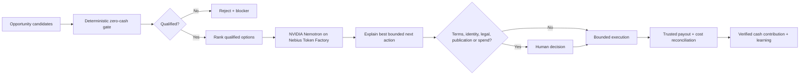

# Earn Before Spend

**A zero-capital opportunity agent that separates model reasoning from economic authority.**

Earn Before Spend helps creators, independent professionals, small businesses, and community organizations answer a deceptively hard question:

> **What is the smallest credible way I can move from $0 in new seed capital to verified positive cash contribution?**

The agent can compare bounties, competitions, services, licenses, affiliate commissions, digital products, and grants/awards. A deterministic Python gate blocks any candidate that requires new cash, hides too much owner labor, has unclear rights or eligibility, or lacks a verifiable payout path.

The model can explain, compare, and orchestrate. **It cannot override the economic rules.**

## Nebius x NVIDIA Global AI Hackathon

**Target track:** Best Apps and Agents

This branch adds a Nebius Token Factory runtime that uses the NVIDIA open-source model **`nvidia/Nemotron-3-Ultra-550b-a55b`**. The deterministic gate still ranks and blocks opportunities first. Nemotron receives only the resulting evaluations and explains the best qualified next action without being allowed to reverse a blocker.

Implemented files:

- `nebius_runtime.py` - OpenAI-compatible Nebius Token Factory runtime adapter
- `nebius_demo.py` - end-to-end Token Factory demo path
- `test_nebius_runtime.py` - adapter tests for API-key gating, endpoint/model selection, response parsing, and blocker preservation
- `NEBIUS_DEVPOST.md` - submission-ready draft, validation status, demo plan, and human gates

Default runtime configuration:

```text
Provider: Nebius Token Factory
Endpoint: https://api.tokenfactory.us-central1.nebius.com/v1
Model: nvidia/Nemotron-3-Ultra-550b-a55b
```

### Run the Nebius path

A real Token Factory API key is required for the live call:

```bash
export NEBIUS_API_KEY="..."
python nebius_demo.py
```

Optional overrides:

```bash
export NEBIUS_BASE_URL="https://api.tokenfactory.us-central1.nebius.com/v1"
export NEBIUS_MODEL="nvidia/Nemotron-3-Ultra-550b-a55b"
```

The code fails closed when `NEBIUS_API_KEY` is missing. No fallback provider is silently substituted for the hackathon runtime.

## Why it matters

People often spend money before validating whether an idea can earn anything at all. Creators and small organizations are especially vulnerable to this pattern: buy software, buy ads, register another domain, subscribe to another AI tool, then hope revenue appears.

Earn Before Spend flips the sequence:

1. Find legitimate opportunities.
2. Prove they can be pursued without new cash.
3. Rank only qualified options.
4. Surface legal, identity, terms, publication, and spending decisions to a human.
5. Take the smallest bounded next action.
6. Treat money as real only after trusted payout verification and cost reconciliation.

A possible prize is not revenue. A test payment is not revenue. An owner deposit is not revenue. Credits are not revenue.

## Architecture



### Authority boundary

- **Deterministic Economic Gate:** decides whether a candidate is economically eligible.
- **NVIDIA Nemotron on Nebius Token Factory:** explains the already-ranked result and preserves context, urgency, and tradeoffs.
- **Human Decision Gate:** terms acceptance, identity attestations, legal commitments, publication, and spending remain human-controlled.
- **Reconciliation Layer:** verifies payouts and subtracts fees, refunds, reserves, and attributable costs before claiming success.

## Guardrails

An opportunity is blocked when any of these are true:

- it requires new cash before the earning event;
- it requires more than the allowed owner-fulfillment time;
- rights are unclear;
- eligibility is unclear;
- payout cannot be independently verified;
- legitimacy is below the threshold;
- the probability input is invalid.

The agent also refuses to treat gambling, paid-entry speculation, securities/crypto trading, owner deposits, loans, gifts, test payments, or hypothetical value as earnings.

## Run the deterministic demo

No model provider is required for the original deterministic demo:

```bash
python demo.py
```

## Run tests

```bash
python -m unittest test_core.py test_nebius_runtime.py -v
```

The current combined suite contains the original guardrail tests plus Nebius adapter tests.

## Original Strands implementation

The repository began as an AWS Agents for Humans project using the Strands Agents SDK. That layer remains available in `agent.py`; the Nebius hackathon branch adds a separate Token Factory path rather than replacing the deterministic core.

To run the Strands version:

```bash
pip install -r requirements.txt
RUN_STRANDS=1 python demo.py
```

## Files

- `core.py` - deterministic qualification and ranking engine
- `agent.py` - Strands tools and system policy
- `demo.py` - deterministic demo and optional Strands path
- `nebius_runtime.py` - Nebius Token Factory + NVIDIA Nemotron adapter
- `nebius_demo.py` - runnable Nebius demo
- `test_core.py` - deterministic guardrail tests
- `test_nebius_runtime.py` - Token Factory adapter tests
- `ARCHITECTURE.md` - original architecture notes
- `DEVPOST.md` - original submission copy
- `NEBIUS_DEVPOST.md` - Nebius x NVIDIA submission draft and gate checklist
- `RESEARCH.md` - two-agent economic-efficiency research protocol

## Development and IP disclosure

- The visible repository history begins during the Nebius x NVIDIA hackathon submission period.
- AI coding assistance was used.
- The Nebius branch adds new runtime integration with Token Factory and NVIDIA Nemotron during that period.
- No private BLVX/Bonita source code, user data, customer data, private prompts, or proprietary cultural datasets are included.
- The concept was informed by earlier private work on safe autonomous-agent economics, but this repository is a standalone public implementation.

## License

MIT
