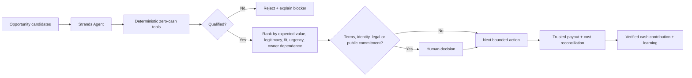

# Earn Before Spend

**A zero-capital opportunity agent built with the Strands Agents SDK.**

Earn Before Spend helps creators, independent professionals, small businesses, and community organizations answer a deceptively hard question:

> **What is the smallest credible way I can move from $0 in new seed capital to verified positive cash contribution?**

The agent does not assume the answer is “start a business.” It can compare different earning pathways such as bounties, competitions, services, licenses, affiliate commissions, digital products, and grants/awards. A deterministic guardrail layer blocks any candidate that requires new cash, hides too much owner labor, has unclear rights or eligibility, or lacks a verifiable payout path.

The LLM can explain, compare, and orchestrate. **It cannot override the economic rules.**

## Why it matters

People often spend money before validating whether an idea can earn anything at all. Creators and small organizations are especially vulnerable to this pattern: buy software, buy ads, register another domain, subscribe to another AI tool, then hope revenue appears.

Earn Before Spend flips the sequence:

1. Find legitimate opportunities.
2. Prove they can be pursued without new cash.
3. Rank only the qualified options.
4. Surface legal/identity/terms decisions to a human.
5. Take the smallest bounded next action.
6. Treat money as real only after trusted payout verification and cost reconciliation.

A possible prize is not revenue. A test payment is not revenue. An owner deposit is not revenue. Credits are not revenue.

## AWS Agents for Humans

**Track:** Professional Agents

This project was created during the AWS Agents for Humans submission period and uses the **Strands Agents SDK** as the agentic layer. AI coding assistance was used during development. No private BLVX/Bonita source code, user data, customer data, private prompts, or proprietary cultural datasets are included in this repository.

## Architecture



### Components

- **Strands Agent**: interprets the user goal, invokes qualification/ranking tools, explains tradeoffs, and proposes the next action.
- **Deterministic Economic Gate**: Python rules that the model cannot override.
- **Human Decision Gate**: terms acceptance, identity attestations, legal commitments, publication, and spending remain human-controlled.
- **Reconciliation Layer (roadmap)**: verifies payouts and subtracts fees, refunds, reserves, and attributable costs before claiming success.

## Beyond the first dollar

Earn Before Spend also informs a two-agent experiment in autonomous economic behavior: Bonita and GPT independently pursue credible earning opportunities under the same zero-new-seed-capital constraint. The research asks how effectively agents discover opportunities, reuse existing resources, adapt after failure, and create verified economic value with minimal human intervention.

The proposed research architecture extends the workflow:

**Discover → Evaluate → Act → Verify → Learn → Research Ledger**

[RESEARCH.md](RESEARCH.md) defines the three-ledger protocol, intended cadence, instrumentation, and comparative metrics, including Autonomous Economic Efficiency. **This is an active research direction; not all telemetry and comparative-learning features are implemented in the current hackathon prototype.** The extended workflow is a research design, not a claim of autonomous execution or verified earnings.

## Guardrails

An opportunity is blocked when any of these are true:

- it requires new cash before the earning event;
- it requires more than the allowed owner-fulfillment time;
- rights are unclear;
- eligibility is unclear;
- payout cannot be independently verified;
- legitimacy is below the threshold;
- the probability input is invalid.

The agent also refuses to treat gambling, paid-entry speculation, securities/crypto trading, owner deposits, loans, gifts, test payments, or hypothetical value as earnings.

## Files

- `core.py` - deterministic qualification and ranking engine
- `agent.py` - Strands tools and system policy
- `demo.py` - deterministic demo by default; optional Strands model run
- `test_core.py` - focused guardrail tests
- `requirements.txt` - Strands Agents SDK dependency
- `ARCHITECTURE.md` - architecture diagram and execution flow
- `DEVPOST.md` - submission copy and disclosure notes
- `RESEARCH.md` - two-agent research protocol, proposed instrumentation, and implementation limits

## Run the deterministic demo

No model provider is required for the default demo.

```bash
python demo.py
```

## Run tests

```bash
python -m unittest test_core.py -v
```

## Run with Strands

Python 3.10+ and a configured Strands-supported model provider are required.

```bash
pip install -r requirements.txt
RUN_STRANDS=1 python demo.py
```

Strands defaults can use Amazon Bedrock, but the SDK is model-agnostic. The deterministic gate remains authoritative regardless of provider.

## Example behavior

Given three opportunities, the agent can preserve an expiring no-fee competition while still identifying a smaller fixed bounty as the more predictable first-dollar path. If joining the competition requires accepting third-party terms, the agent stops and surfaces that exact decision to the human instead of silently accepting it.

## Development disclosure

- Built during the AWS Agents for Humans submission period.
- AI coding assistance was used.
- Standard Python library and Strands Agents SDK are used.
- The concept was informed by earlier private work on safe autonomous-agent economics, but this public project is a new standalone implementation and contains no private code imports or private data.

## License

MIT
